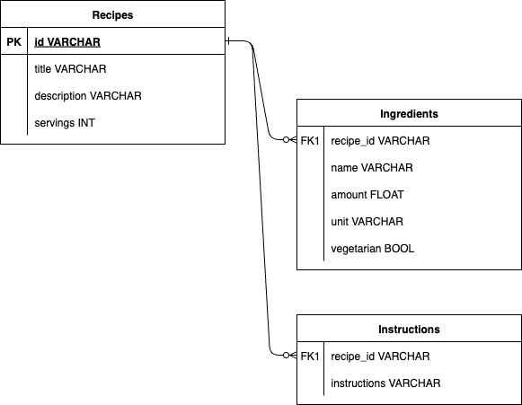

# ReciMe-Coding-Challenge

## Local Development Setup
For local development, you can use the following steps in order to set up the environment:

### Option 1: Using Docker
This is the fastest way to get started. On the project root, run the following command to start the application:

```bash
docker-compose up
```

Or if you want to run it in detached mode:

```bash
docker-compose up -d
```

### Option 2: Manual Setup
The local environment can be set up manually by running a PostgreSQL database instance on your machine. Instructions to 
do so will not be included here, but you will need to set up your database to meet the following:

```yaml
url: jdbc:postgresql://localhost:5432/recime_db
username: recime_user
password: recime_password
```

Or you can define your own database credentials in the `src/main/resources/application.yml` file.

## Design Decisions

### #1: Data Model
The Recipe entity is designed to be simple and straightforward, with the following fields:
```json
{
  "id": "String", 
  "title": "String",
  "description": "String",
  "servings": "Integer",
  "ingredients": [
    {
      "name": "String",
      "amount": "Numeric",
      "unit": "String",
      "isVegetarian": "Boolean"
    }
  ],
  "instructions": [
    "String"
  ],
  "vegetarian": "Boolean"
}
```

<details><summary>Sample Recipe</summary>
<pre>
{
    "id": "809389cf-8785-4956-ab79-53b66b911f4f",
    "title": "Pork Adobo",
    "description": "The classic Filipino dish",
    "ingredients": [
        {
            "amount": 1.0,
            "unit": "kg",
            "name": "pork belly",
            "vegetarian": false
        },
        {
            "amount": 2.0,
            "unit": "clove",
            "name": "garlic",
            "vegetarian": true
        },
        {
            "amount": 5.0,
            "unit": null,
            "name": "bay leaf",
            "vegetarian": true
        },
        {
            "amount": 4.0,
            "unit": "tbsp",
            "name": "vinegar",
            "vegetarian": true
        },
        {
            "amount": 0.5,
            "unit": "cup",
            "name": "soy sauce",
            "vegetarian": true
        },
        {
            "amount": 1.0,
            "unit": "tbsp",
            "name": "peppercorn",
            "vegetarian": true
        },
        {
            "amount": 2.0,
            "unit": "cup",
            "name": "water",
            "vegetarian": true
        }
    ],
    "instructions": [
        "Tenderize the pork",
        "Add soy sauce",
        "Add vinegar",
        "Let it all boil for 30 hours"
    ],
    "servings": 1,
    "vegetarian": false
}
</pre>
</details>

The following ERD describes the data model in the database:



> ⚠️ **Note:** The `vegetarian` field is a derived field and is not stored in the database. It is true if and only if 
> all ingredients are vegetarian. See more in the [Assumptions Made](#assumptions-made) section.

#### Entity vs Embeddable

A design decision of note is to implement Ingredients and Instructions as embeddable objects within the Recipe entity. 
Conceptually, an ingredient and an instruction are not entities on their own, but rather part of a recipe.

#### Normalized vs Denormalized

The database tables are designed to be normalized, with the embedded Ingredients and Instructions stored in their own 
tables.

While it is possible for a denormalized Recipe table to exist using JSON columns in Postgres, normalization allows for 
faster querying and data integrity.

This is also the default implementation of Spring Data JPA for embedded objects.

### #2: API Design
The API is designed to be RESTful, with the following endpoints:
- `GET /recipes`: Retrieve all recipes, with optional query parameters for filtering
- `GET /recipes/{id}`: Retrieve a specific recipe by its unique ID
- `POST /recipes`: Create a new recipe
- `PUT /recipes/{id}`: Update an existing recipe by its unique ID
- `PATCH /recipes/{id}`: Partially update an existing recipe by its unique ID
- `DELETE /recipes/{id}`: Delete a specific recipe by its unique ID

The above endpoints are designed to be intuitive and follow RESTful principles. The use of plural nouns for resources 
(i.e. `recipes`) is a common convention in RESTful APIs, and the use of HTTP methods (GET, POST, PUT, PATCH, DELETE) 
aligns with the intended actions on the resources.

### #3: Error Handling
Error handling is implemented using Spring's `@ControllerAdvice` to handle exceptions globally. This allows for 
consistent error responses across the application.

### #4: Database-Level Search
The search functionality is delegated to the repository-layer for scalability. While it might be tempting to fetch all 
recipes then implement Java Streams to filter the results, this would not be efficient for larger datasets and will 
rely heavily on application memory and compute power.

While tradeoffs can be discussed (i.e. database performance vs application performance), it's generally good 
practice to delegate functionality that can be handled by the database to the database itself.

## Assumptions Made
1. The recipe exists as an isolated entity and does not have any dependencies on other entities. (i.e. ingredients are 
stored _as-is_ as described in the recipe upon creation)
2. Recipes are identified solely by their unique ID. This is to allow multiple recipes for the same dish but with 
different ingredients or instructions.
3. There is no checking for duplicate recipes. This is to allow users to create similar recipes with slight variations. 
This is also the current implementation in the ReciMe app.

### On being "vegetarian"
**It is assumed that a recipe is vegetarian if all of its ingredients are vegetarian.** 

An earlier option was to simply declare the entire recipe as vegetarian or not regardless of the ingredients, delegating 
the decision to the application client. This, however, would have an impact on the recipe update use case where the 
ingredients can be added or removed. When a vegetarian recipe is updated to include a non-vegetarian ingredient, the 
application client would have to be aware of this and update the vegetarian field of the recipe accordingly. This would
be an unnecessary complexity for the client and would require additional logic to handle this case.

As such, the decision was made to derive the vegetarian field from the ingredients. This way, the recipe is always
consistent with its ingredients, and the application client does not have to worry about updating the vegetarian field
when the ingredients change.
