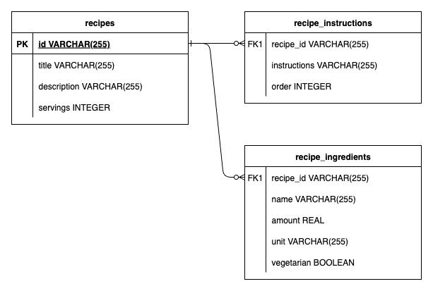
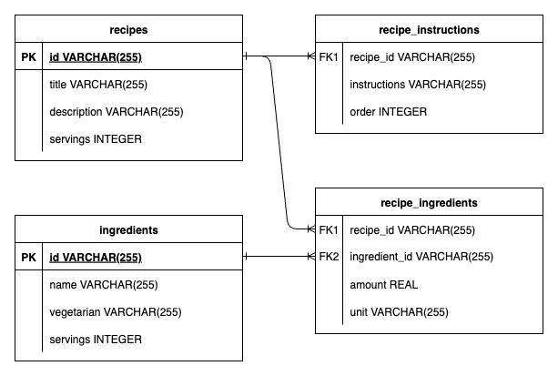

# ReciMe-Coding-Challenge

Carlo's entry for the ReciMe coding challenge.

## Table of Contents

- [Quick Start](#quick-start)
- [Local Development Setup](#local-development-setup)
  - [Option 1: Using Docker](#option-1-using-docker)
  - [Option 2: Manual Setup](#option-2-manual-setup)
  - [Building the Application](#building-the-application)
- [Design Decisions](#design-decisions)
  - [#1: Data Model](#1-data-model)
    - [On being "vegetarian"](#on-being-vegetarian)
    - [Entity vs Embeddable](#entity-vs-embeddable)
    - [Normalized vs Denormalized](#normalized-vs-denormalized)
  - [#2: API Design](#2-api-design)
  - [#3: Error Handling](#3-error-handling)
  - [#4: Database-Level Search](#4-database-level-search)
  - [#5: Sortable Properties](#5-sortable-properties)
- [Other Assumptions Made](#other-assumptions-made)
- [Possible Future Enhancements](#possible-future-enhancements)
  - [Determining "Vegetarian-ness"](#determining-vegetarian-ness)
  - [Testing](#testing)
  - [Database Schema Management](#database-schema-management)
- [Author](#author)

## Quick Start

To run the application:

```bash
docker compose up
```

Or if you want to run it in detached mode:

```bash
docker compose up -d
```

The Postman collection is available in the `docs/postman` directory. You can import it into Postman to test the API 
endpoints.

> ⚠️ **Note:** If the docker compose command fails (e.g. platform mismatch), you can try running the application 
> manually by running the following commands in the project root:
> ```bash
> mvn clean install && java -jar target/recime-coding-challenge-1.0.0-SNAPSHOT.jar
> ```

## Local Development Setup
For local development, you can use the following steps in order to set up the environment:

### Option 1: Using Docker
This is the fastest way to get started. On the project root, run the following command to start the application:

```bash
docker compose -f docker-compose-local-env.yml up
```

Or if you want to run it in detached mode:

```bash
docker compose -f docker-compose-local-env.yml up -d
```

### Option 2: Manual Setup
The local environment can be set up manually by running a PostgreSQL database instance on your machine. Instructions to 
do so will not be included here, but you will need to set up your database to meet the following:

```yaml
url: jdbc:postgresql://localhost:5432/recime_db
username: recime_user
password: recime_password
```

Or you can define your own database credentials in the `src/main/resources/application.yml` file.

### Building the Application
To build the application as a Docker image, run the following command in the project root:

```bash
docker build -t cpmiras/recime-coding-challenge:latest .
```

This will build the Docker image locally with the tag used in the `docker-compose.yml` file.

## Design Decisions

### #1: Data Model
The Recipe entity is designed to be simple and straightforward, with the following fields:
```json
{
  "id": "String", 
  "title": "String",
  "description": "String",
  "servings": "Integer",
  "ingredients": [
    {
      "name": "String",
      "amount": "Numeric",
      "unit": "String",
      "vegetarian": "Boolean"
    }
  ],
  "instructions": [
    "String"
  ],
  "vegetarian": "Boolean"
}
```

<details><summary>Sample Recipe</summary>
<pre>
{
    "id": "809389cf-8785-4956-ab79-53b66b911f4f",
    "title": "Pork Adobo",
    "description": "The classic Filipino dish",
    "ingredients": [
        {
            "amount": 1.0,
            "unit": "kg",
            "name": "pork belly",
            "vegetarian": false
        },
        {
            "amount": 2.0,
            "unit": "clove",
            "name": "garlic",
            "vegetarian": true
        },
        {
            "amount": 5.0,
            "unit": null,
            "name": "bay leaf",
            "vegetarian": true
        },
        {
            "amount": 4.0,
            "unit": "tbsp",
            "name": "vinegar",
            "vegetarian": true
        },
        {
            "amount": 0.5,
            "unit": "cup",
            "name": "soy sauce",
            "vegetarian": true
        },
        {
            "amount": 1.0,
            "unit": "tbsp",
            "name": "peppercorn",
            "vegetarian": true
        },
        {
            "amount": 2.0,
            "unit": "cup",
            "name": "water",
            "vegetarian": true
        }
    ],
    "instructions": [
        "Tenderize the pork",
        "Add soy sauce",
        "Add vinegar",
        "Let it all boil for 30 hours"
    ],
    "servings": 1,
    "vegetarian": false
}
</pre>
</details>

The following ERD describes the data model in the database:



> ⚠️ **Note:** The `vegetarian` field is a derived field and is not stored in the database. It is true if and only if
> all ingredients are vegetarian. See more in the [On being "vegetarian"](#on-being-vegetarian) section below.

#### On being "vegetarian":

**_It is assumed that a recipe is vegetarian if all of its ingredients are vegetarian._**

An earlier option was to simply declare the entire recipe as vegetarian or not regardless of the ingredients, delegating
the decision to the application client. This, however, would have an impact on the recipe update use case where the
ingredients can be added or removed. When a vegetarian recipe is updated to include a non-vegetarian ingredient, the
application client would have to be aware of this and update the vegetarian field of the recipe accordingly. This would
be an unnecessary complexity for the client and would require additional logic to handle this case.

As such, the decision was made to derive the vegetarian field from the ingredients. This way, the recipe is always
consistent with its ingredients, and the application client does not have to worry about updating the vegetarian field
when the ingredients change.

Another question would be: _"Why should the application client be the one to determine if an ingredient is vegetarian or 
not?"_ This was done for simplicity because determining "vegetarian-ness" actually turned out to be a difficult problem. 
For this, see more on the [Possible Enhancements](#possible-enhancements) section below.

#### Entity vs Embeddable:

A design decision of note is to implement Ingredients and Instructions as embeddable objects within the Recipe entity. 
Conceptually, an ingredient and an instruction are not entities on their own, but rather part of a recipe.

#### Normalized vs Denormalized:

The database tables are designed to be normalized, with the embedded Ingredients and Instructions stored in their own 
tables.

While it is possible for a denormalized Recipe table to exist using JSON columns in Postgres, normalization allows for 
faster querying and data integrity.

This is also the default implementation of Spring Data JPA for embedded objects.

### #2: API Design
The API is designed to be RESTful, with the following endpoints:
- `GET /recipes`: Retrieve recipes, with pagination capability and optional query parameters for filtering
- `GET /recipes/{id}`: Retrieve a specific recipe by its unique ID
- `POST /recipes`: Create a new recipe
- `PUT /recipes/{id}`: Replace an existing recipe by its unique ID
- `PATCH /recipes/{id}`: Partially update an existing recipe by its unique ID
- `DELETE /recipes/{id}`: Delete a specific recipe by its unique ID

The above endpoints are designed to be intuitive and follow RESTful principles. The use of plural nouns for resources 
(i.e. `recipes`) is a common convention in RESTful APIs, and the use of HTTP methods (GET, POST, PUT, PATCH, DELETE) 
aligns with the intended actions on the resources.

### #3: Error Handling
Error handling is implemented using Spring's `@ControllerAdvice` to handle exceptions globally. This allows for 
consistent error responses across the application.

### #4: Database-Level Search
The search functionality is delegated to the repository-layer for scalability. While it might be tempting to fetch all 
recipes then implement Java Streams to filter the results, this would not be scalable for larger datasets and will 
rely heavily on application memory and compute power.

While tradeoffs can be discussed (e.g. database performance vs application performance, database query maintainability), 
it's generally good practice to delegate functionality that can be handled by the database to the database itself.

### #5: Sortable Properties
Notice that using `ingredients` and `instructions` as sort properties is not allowed as it needs further refinement. 
_How_ will recipes be sorted by their ingredients? Is it by name using the first ingredient? Or by the number of 
ingredients? How about for instructions?

As such, it's decided to not allow sorting by these properties.

## Other Assumptions Made
1. The recipe exists as an isolated entity and does not have any dependencies on other entities. (i.e. ingredients are 
stored _as-is_ as described in the recipe upon creation)
2. Recipes are identified solely by their unique ID. This is to allow multiple recipes for the same dish but with 
different ingredients or instructions.
3. There is no checking for duplicate recipes. This is to allow users to create similar recipes with slight variations. 
This is also the current implementation in the ReciMe app.

## Possible Future Enhancements

### Determining "Vegetarian-ness"
Determining if an ingredient is vegetarian or not is a complex problem. A possible enhancement would be to create a 
master table of ingredients with their vegetarian status, and then use this list to determine if a recipe is vegetarian 
or not. See below diagram for a possible future data model with a separate `Ingredient` entity which contains the 
vegetarian flag:



Maintaining this master table is another complex problem. It would require a comprehensive list of ingredients and 
their vegetarian status. But _who_ will maintain this list? 

One option is to have an admin interface where an admin can add or update ingredients and their vegetarian status. But 
this will require tremendous human effort and will not capture all possible ingredients out there.

Another option is to utilize AI solutions which can serve as a knowledge base for ingredients and their vegetarian status. 
This would require an AI model that can accurately determine if an ingredient is vegetarian or not, and this is a 
complex problem in itself.

Suffice it to say, determining "vegetarian-ness" is a difficult problem that requires careful consideration and design 
which may be too much for the scope of this coding challenge. As such, the current implementation simply delegates the 
decision to the application client.

### Testing
The current implementation includes a unit test for the service layer but no integration tests. Integration tests were 
not added due to the high effort needed (setting up Testcontainers for database mocking, scenario listing for 
happy path and edge cases, additional test environment configuration, etc.) which unfortunately I'm no longer able to 
cover in the time allotted for this coding challenge. Apologies! But I'm more than happy to add them in the future.

### Database Schema Management
Requirements may require changes to the data model, and by extension, the database schema. Tools like Liquibase can be 
implemented to manage database schema changes in a structured and maintainable way.

## Author

**Author:** @MirasCarlo934
